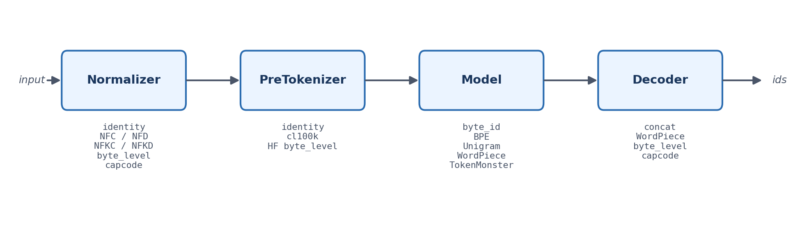
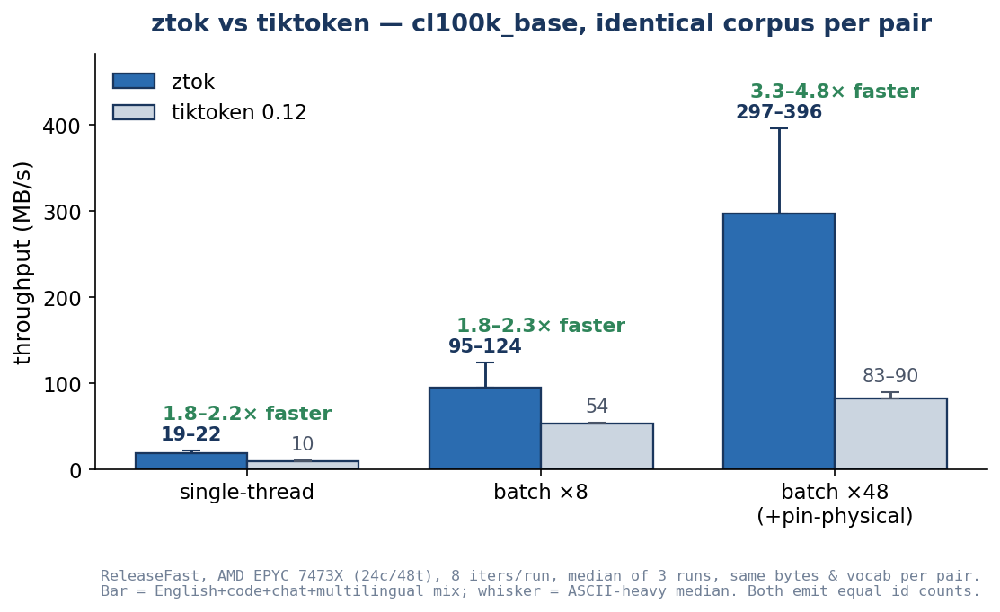
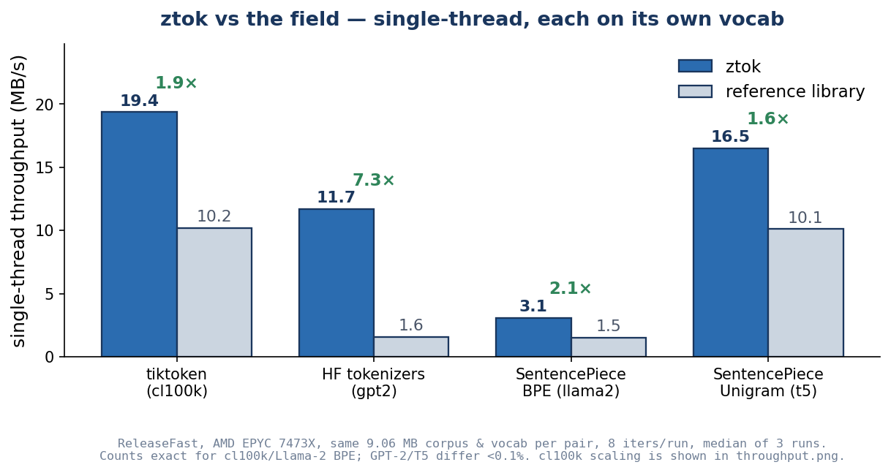

# ztok

A fast, multithreaded, data-oriented tokenizer toolkit in Zig 0.16.

`v1.28.0` · **AGPL-3.0-only** · 1150+ tests · 8 language bindings · bit-identical with tiktoken / HuggingFace / SentencePiece

ztok loads the tokenizers you already use and produces **byte-identical**
output: 13/13 SentencePiece + HuggingFace reference pairs match at
100/100 on the 100-line gate, and 64/65 cells at 100.000% on the
10K-line stress sweep (the one residual is a documented Viterbi
tie-break on `t5 × code`). Then it goes past parity — see
[Beyond bit-identical](#beyond-bit-identical-post-125).

### Highlights

- **Four model families** — byte-level BPE (greedy / longest-match /
  optimal), Unigram (Viterbi), WordPiece, and TokenMonster ungreedy.
- **Fast, parallel by default** — cl100k at **~19–22 MB/s** single-thread
  scaling to **~297–396 MB/s** batched ×48 +pin (multilingual mix →
  ASCII-heavy corpus), **1.8–4.8× faster than tiktoken** on identical
  bytes (chart below); portable AVX2/NEON SIMD byte scanners; per-thread
  arenas, no hot-path allocs.
- **8 language bindings** over one stable C ABI — Python, Node.js, Ruby,
  Go, Rust, .NET, Java, Swift.
- **Loads everything** — `.tiktoken`, HF `tokenizer.json`, SentencePiece
  `.model`, ztok `.ztm`, Mistral Tekken `.json`; with format auto-detect.
- **Beyond the field** — optimal (min-token) encoding, PathPiece
  training, per-token overlay channels, grammar-constrained
  tokenization, token healing, cross-tokenizer transcoding, multimodal
  (text + image + audio), and an `explain` debugger.

Absorbs the best ideas from tiktoken, HuggingFace tokenizers,
SentencePiece, and TokenMonster (see [`COMPARISON.md`](COMPARISON.md)).
A single `Pipeline` value of four tagged-union stages — no vtables, no
per-token heap allocations on the hot path. See
[`CHANGELOG.md`](CHANGELOG.md) for the per-release story (every minor
version: headline, perf numbers, equivalence deltas).



<sub>Regenerate with `python3 docs/pipeline_diagram.py`.</sub>

## Status — 1.27

| | |
|---|---|
| **Models** | byte-level BPE (3 encode modes: `bpe_merge` / `longest_match` / `optimal`), Unigram (Viterbi + sampling), WordPiece, TokenMonster ungreedy, `byte_id`. All support `encodeWithOffsets` — per-token byte spans in original-input coordinates, even through non-identity normalizers. |
| **Pre-tokenizers** | identity, cl100k_base (Unicode `\p{L}\p{N}\s`, UCD 16.0), HF GPT-2 ByteLevel, Tekken |
| **Normalizers** | identity, NFC / NFD / NFKC / NFKD, byte_level, capcode (+ TM-compat), SentencePiece precompiled (NFKC + charsmap trie), and the full HF chain (Replace / Strip / Lowercase / BertNormalizer / Sequence, incl. regex Replace). All expose origin maps for byte-accurate offsets. |
| **Decoders** | concat, wordpiece, byte_level, capcode |
| **Post-processors** | Bert, Template, Roberta, ByteLevel, Sequence — round-trip through the HF JSON reader/writer |
| **Chat templates** | Jinja subset — ChatML, Mistral, Llama-2, Gemma (render + invert) |
| **Special tokens** | `added_tokens.Scanner` resolves specials before pre-tokenization; Unicode-aware lstrip/rstrip |
| **Loaders** | `.tiktoken`, HF `tokenizer.json` (BPE / WordPiece / Unigram), SentencePiece `.model` (BPE / Unigram + byte_fallback), ztok `.ztm` (Monster), Mistral Tekken `.json`, HF `tokenizer_config.json` — with format auto-detect |
| **Writers** | HF `tokenizer.json` (+ post-processors), SentencePiece `.model`, ztok `.ztm` |
| **Training** | BPE, Unigram (EM + subword regularization), WordPiece, TokenMonster distillation, PathPiece (CTC-minimizing) |
| **Performance** | cl100k vs **tiktoken** on identical corpus bytes (EPYC 24c/48t, ReleaseFast; median of 3 runs), shown as a range across a multilingual mix and an ASCII-heavy corpus: **~19–22 vs 10–11 MB/s** single-thread (1.8–2.2×), **~95–124 vs 54** batch ×8 (1.8–2.3×), **~297–396 vs 83–90** batch ×48 +pin (3.3–4.8×). Gap widens with core count — chart below. |
| **Targets** | x86_64 / aarch64 native; wasm32-wasi (static lib); wasm32-freestanding (browser, SIMD128) |
| **C ABI** | `libztok.{a,so}` + `include/ztok.h` — persistent batch pools, streaming encode, overlay channels, format auto-detect; CMake + pkg-config install via `zig build -p <prefix>` |
| **Language bindings** | **8** — Python, Node.js, Ruby, Go, Rust, .NET, Java, Swift — over one C ABI, each with round-trip fuzz harnesses |
| **Diagnostics & ops** | `doctor` (lint checks), `eval` (bytes/token, per-script fertility, fairness, cost), `diff` (compare two pipelines), `prefix_cache` (in-memory + optional persistent on-disk) |
| **Vocab ops** | `vocab_extend` (domain tokens + embedding-init plan), `vocab_prune`, `merge-vocab`, `adapt-vocab` |
| **Chunking / RAG** | token-cap windows with overlap over `encodeWithOffsets`; boundary modes (token / codepoint / word / word_dict / sentence / paragraph), byte-accurate ranges; multi-language sentence + Thai/Lao/zh/ja word segmenters (approximation-grade) |
| **CLI** | 19 subcommands incl. `encode` / `encode-multimodal` / `decode` / `explain` / `train` / `chunk` / `eval` / `transcode` / `serve` / `bench` / `visualize`. `serve` is an HTTP + gRPC server with token/OIDC auth, rate limiting, TLS, and a persistent prefix cache. |
| **Tests** | **1150+** native tests plus per-binding suites, cold-cache integrated rebuild verified |
| **Ops / quality** | GitHub Actions CI (Linux + macOS), nightly fuzz cron, weekly equivalence sweep, multi-stage Dockerfile (~42 MiB distroless image), Helm chart |



<sub>Bar = multilingual-mix median; whisker = ASCII-heavy median. Three independent 8-iteration runs per value, same vocab, corpus bytes, and machine; both tokenizers emit equal id counts. Raw data: `docs/benchmark_data.json`. Regenerate with `python3 docs/throughput_chart.py`.</sub>

ztok is faster than each reference library on *its own vocab*, too —
single-thread, same 9 MB corpus and respective vocab per pair:



<sub>Median of three runs: **1.9×** vs tiktoken (cl100k), **7.3×** vs HF tokenizers (gpt2), **2.1×** vs SentencePiece BPE (llama2), **1.6×** vs SentencePiece Unigram (t5). Counts are exact for cl100k/Llama-2 BPE and differ by less than 0.1% for GPT-2/T5. Raw data: `docs/benchmark_data.json`. Regenerate with `python3 docs/competitors_chart.py`.</sub>

## Beyond bit-identical (post-1.25)

ztok matches tiktoken / HF / SentencePiece bit-for-bit (13/13 pairs at
100/100 on the 100-line gate). These capabilities go *past* parity —
none of the four reference libraries offers them. See
[`COMPARISON.md`](COMPARISON.md) for the full matrix.

- **Optimal (minimum-token) encoding** — `EncodeMode.optimal` does a DP
  over the vocab lattice to emit the provably fewest tokens for a vocab.
  `ztok encode --optimal` / `ztok roundtrip --optimal`.
- **PathPiece training** — `ztok train --kind pathpiece` learns a vocab
  by directly minimizing Corpus Token Count under shortest-path
  segmentation (top-down pruning). Emits a `.tiktoken` vocab; load as
  bpe and run with `--optimal`.
- **Overlay channels** — `encodeWithOverlays` / `ztok_encode_with_overlays`
  return per-token annotation channels (byte span, boundary bitset,
  provenance, + pluggable domain channels) aligned 1:1 with the id
  stream, without altering tokenization. See `examples/c/overlays.c`.
- **Grammar-constrained tokenization** — token-prefix automaton
  (`constrained.zig`) yields the allowed-next-token set for logit
  masking in structured generation.
- **Token healing** — trims mid-token prompt tails so generation
  resumes on a natural boundary (`token_healing.zig`).
- **Cross-tokenizer transcoding** — `ztok transcode --from A --to B`
  re-maps ids between vocabs through a lossless text bridge.
- **Tokenization debugger** — `ztok explain` reports per-token
  why-chosen (merge sequence / Viterbi / Monster branch), text or JSON.
- **Multimodal encode** — `ztok encode-multimodal` for Mistral Tekken
  text + image + audio in one unified stream.

## Build

```sh
zig build                # static lib, shared lib, CLI, header into zig-out/
zig build test           # 1150+ unit and integration tests
zig build run -- encode --model bench/vocabs/cl100k_base.tiktoken --cl100k "hello world"
```

### WASM (browser)

ztok cross-compiles to a small `wasm32-freestanding` module suitable
for loading directly from a `<script type="module">`. Post-1.19 the
default build enables the WebAssembly SIMD128 proposal so `@Vector`
ops lower to `v128.*` / `i32x4.*` opcodes (instead of scalar
fallbacks). The full encoder still fits in ~310 KB ungzipped /
~110 KB gzipped — SIMD adds about 1 KB to the binary.

```sh
zig build ztok-wasm-browser            # → zig-out/bin/ztok_browser.wasm (SIMD128)
zig build ztok-wasm-browser-scalar     # → zig-out/bin/ztok_browser_scalar.wasm (control / fallback)
cd examples/wasm && python3 -m http.server   # serves index.html on :8000
# Then open http://localhost:8000/ and load a cl100k_base.tiktoken file.
```

The browser pages (`index.html`, `bench.html`) feature-detect SIMD128
at load time via `WebAssembly.validate` on a 22-byte `v128.const`
probe and refuse to load if it's missing (Chrome 91+ / Firefox 89+ /
Safari 16.4+ all support it). For legacy-browser support, point
`fetch(...)` at the scalar artifact instead.

`examples/wasm/bench.html` benchmarks ztok-wasm vs `tiktoken-js` on
the same vocab in the same tab. `examples/wasm/node_bench_simd.mjs`
is a runtime-agnostic Node harness that loads both the SIMD and
scalar wasm side-by-side and reports their throughput plus the lift
ratio — useful for CI / regression tracking. `node_smoke.mjs` is the
minimum-round-trip smoke test.

Honest perf numbers (Node v25, synthetic ~5K-merge vocab built from
the corpus itself, `corpus-small.txt` 100 KB, 30 iters):

| build | corpus shape | throughput |
|-------|--------------|-----------:|
| ztok-wasm SIMD128 | English (cl100k-shaped) | 10.51 MB/s |
| ztok-wasm scalar  | English (cl100k-shaped) | 10.03 MB/s |
| ztok-wasm SIMD128 | HEAVY=1 (base64 long runs) | 11.77 MB/s |
| ztok-wasm scalar  | HEAVY=1 (base64 long runs) | 12.46 MB/s |

The SIMD lift on cl100k-shaped inputs is small (≈1.0× — within
noise) because most BPE merge-loop spans are shorter than the
16-lane vector body: either they bypass `scanMin` for the heap path
(live > 64) or they fit in the scalar tail (live < 16). The SIMD
opcodes ARE emitted (see `examples/wasm/check_exports.zig`
SIMD-prefix test asserts `i32x4.min_u`, `v128.load`,
`i8x16.shuffle`, etc. in the code section); they just don't
dominate the time on cl100k where the BPE hashmap lookup is the
real bottleneck. Native single-thread is ~26 MB/s for reference.

## Zig usage

```zig
const std = @import("std");
const ztok = @import("ztok");

pub fn main() !void {
    var gpa: std.heap.DebugAllocator(.{}) = .init;
    defer _ = gpa.deinit();
    const a = gpa.allocator();

    var bpe = try ztok.Bpe.loadTiktokenFile(a, "cl100k_base.tiktoken");
    defer bpe.deinit();

    var v = ztok.Vocab.empty(a);
    defer v.deinit();

    const pipe: ztok.Pipeline = .{
        .normalizer = .nfc,                 // NFC normalize input
        .pre_tokenizer = .cl100k,           // cl100k regex split
        .model = .{ .bpe = &bpe },          // BPE encode
        .decoder = .concat,
        .vocab = &v,
    };

    const ids = try pipe.encode(a, "hello world");
    defer a.free(ids);

    // Multithreaded batch
    var pool = try ztok.thread_pool.BatchPool.init(a, null);
    defer pool.deinit();

    const inputs = [_][]const u8{ "foo", "bar", "baz" };
    var results: [3][]ztok.TokenId = undefined;
    try pipe.encodeBatch(a, &pool, &inputs, &results);
    defer for (results) |r| a.free(r);
}
```

## Python

Stdlib-only `ctypes` wrapper around `libztok` (see `bindings/python/`):

```python
import ztok

with ztok.Pipeline.from_path("tokenizer.json") as pipe, \
     ztok.BatchPool(workers=8) as pool:
    print(pipe.encode_batch(pool, ["hello world", "foo bar"]))
```

Install with `pip install ./bindings/python` after `zig build`. Auto-detects `.tiktoken` / HF `tokenizer.json` / SentencePiece `.model` / TokenMonster `.ztm` via the C-ABI `ztok_auto_detect` (no Python-side magic-byte mirror). Zero non-stdlib runtime deps.

Streaming encode (id-as-it-arrives, 64 KiB feeds by default):

```python
with ztok.Pipeline.from_path("cl100k.tiktoken") as pipe:
    for batch in pipe.encode_stream(open("doc.txt").read()):
        print(batch)
```

## Node.js

Thin `koffi` wrapper around `libztok` (see `bindings/nodejs/`):

```javascript
const ztok = require('ztok');
const pipe = ztok.Pipeline.fromPath('tokenizer.json'); // auto-detects format
console.log(pipe.encode('hello world'));                // -> Uint32Array
pipe.close();
```

Install with `npm install` from `bindings/nodejs/` after `zig build`. Single
runtime dep (`koffi`), no native compile step, Node 16+. Auto-detects all
four formats via the C-ABI `ztok_auto_detect`. Ships a complete `index.d.ts`
so TypeScript callers get full intellisense. Streaming + multithreaded
batching mirror the Python API.

## Ruby

Thin `ffi`-gem wrapper around `libztok` (see `bindings/ruby/`):

```ruby
require "ztok"
pipe = Ztok::Pipeline.from_path("tokenizer.json") # auto-detects format
puts pipe.encode("hello world").inspect            # => [15339, 1917]
pipe.close
```

Install with `gem install ./bindings/ruby` after `zig build`. Single
runtime dep (`ffi`), no native compile step in the gem install path,
Ruby 3.0+. Auto-detects all four formats via the C-ABI
`ztok_auto_detect`. Pipeline / BatchPool / StreamEncoder mirror the
Python and Node.js APIs; lifetimes use `ObjectSpace.define_finalizer`
(Ruby's analog to `weakref.finalize` / `FinalizationRegistry`) with a
class-method-built proc that doesn't pin `self`.

## Go

cgo wrapper around `libztok` (see `bindings/go/`):

```go
import ztok "github.com/sirus20x6/ztok-go"

pipe, _ := ztok.Open("tokenizer.json")   // auto-detects format
defer pipe.Close()
ids,  _ := pipe.Encode("hello world")
fmt.Printf("%d ids -> %q\n", len(ids), must(pipe.Decode(ids)))
```

Install with `go get github.com/sirus20x6/ztok-go` (placeholder import
path) after `zig build -p zig-out`. Stdlib-only, Go 1.21+, picks up
include + link flags via `#cgo pkg-config: ztok` when `ztok.pc` is on
`PKG_CONFIG_PATH` and falls back to `-lztok` otherwise. cgo per-call
overhead measures ~49 ns/op against `Version()`, so batch via
`BatchPool` for serving workloads. Pipeline / BatchPool / streaming all
mirror the Python and Node.js APIs; handle lifetime is managed with
`runtime.SetFinalizer`.

### Training a new vocab

```zig
const corpus = try std.fs.cwd().readFileAlloc(a, "corpus.txt", 1 << 30);
defer a.free(corpus);

var pool = try ztok.thread_pool.BatchPool.init(a, null);
defer pool.deinit();

var bpe = try ztok.train_bpe.trainFromBytes(
    a, corpus, &ztok.cl100k.split,
    .{ .vocab_size = 32_000, .pool = &pool },
);
defer bpe.deinit();
// bpe is ready to encode immediately
```

## CLI

```sh
ztok train     --kind bpe|unigram|wordpiece|monster \
               --input corpus.txt --vocab-size 32000 --output mine.tiktoken \
               --cl100k --threads 8
ztok encode    --model mine.tiktoken --cl100k "the quick brown fox"
ztok decode    --model mine.tiktoken 116 259 266 275 281
ztok info      --model mine.tiktoken
ztok chunk     --model mine.tiktoken --cl100k --max-tokens 256 --overlap 32 \
               --boundary sentence --format jsonl < document.txt
ztok validate  --model mine.tiktoken [--checks LIST] [--format text|json] [--fixtures FILE]
ztok roundtrip --model mine.tiktoken [--summary] [INPUT|--stdin]
ztok diff      --a A.tiktoken --b B.ztm [--cl100k] [--format text|json] [INPUT|--stdin]
ztok eval      --model M.model [--cl100k] [--format text|json] \
               [--top-k N] [--bottom-k N] [--hidden-dim N] [INPUT|--stdin]
ztok bench     [--quick] [--iters N] [--format text|json] \
               [--include cl100k,sp-bpe,sp-unigram,tm,hf-bpe] [--vocab-root DIR]
ztok serve     --model M.tiktoken [--cl100k] \
               [--host 127.0.0.1] [--port 7890] [--workers N] \
               [--connection-workers N] [--connection-queue N] \
               [--bpe-hot-table on|off] \
               [--auth-token TOKEN | --auth-token-file PATH] \
               [--rate-limit REQ_PER_SEC]
```

### HTTP serving (`ztok serve`)

Binds an HTTP/1.1 server on `127.0.0.1:7890` (default) so Python/Node/Ruby/Go
clients can tokenize without a native binding. Routes:
`POST /encode` (JSON), `POST /encode_stream` (JSON in, NDJSON out — one
`{"ids":[...]}` per batch + final `{"done":true}`), `POST /encode_chunked`
(raw bytes in via chunked or content-length, NDJSON over chunked transfer-
encoding out — same `{"ids":[...]}\n...\n{"done":true}` shape; lets
non-Zig clients stream multi-GB inputs without buffering), `POST /decode`
(JSON), `POST /eval` (mirrors the `ztok eval` JSON schema), `GET /version`,
`GET /health`. Independent connections run through a bounded persistent
worker pool (auto-sized to at most 32 workers); `--connection-workers` and
`--connection-queue` override its concurrency and backpressure limits. Each
connection worker reuses tokenizer scratch memory. The non-reentrant
tokenizer `BatchPool` is shared safely for large parallel encodes;
`/encode_stream` and `/encode_chunked` both run the `StreamEncoder` which
emits ids as bytes arrive and defers the trailing partial codepoint /
pre-tokenizer span to the next feed.

Raw `.tiktoken` models keep the single-thread-friendly BPE hot table off by
default. Multi-core deployments can benchmark and opt in with
`--bpe-hot-table on`; `off` is also available to override HF BPE's existing
serving-oriented default.

```sh
ztok serve --model cl100k_base.tiktoken --cl100k &
curl -sX POST -H 'Content-Type: application/json' \
     -d '{"text":"hello world"}' http://127.0.0.1:7890/encode
# {"ids":[15339,1917]}
curl -sX POST -d '{"ids":[15339,1917]}' http://127.0.0.1:7890/decode
# {"text":"hello world"}
curl -sX POST -d '{"text":"long document..."}' http://127.0.0.1:7890/encode_stream
# {"ids":[...]}\n{"ids":[...]}\n...\n{"done":true}

# Chunked route — request body IS the input bytes (no JSON wrapper).
# Works with curl's chunked mode AND content-length, server reads via
# stdlib chunked dechunker, response is chunked NDJSON.
curl -sX POST -H 'Transfer-Encoding: chunked' \
     --data-binary @big_file.txt \
     http://127.0.0.1:7890/encode_chunked
# {"ids":[...]}\n{"ids":[...]}\n...\n{"done":true}
```

`/encode_chunked` caps cumulative request body bytes at
`Options.max_body_bytes` (default 16 MiB); going over yields a final
`{"error":"body_too_large"}` NDJSON line on the wire and closes the
chunked response. Memory in the encoder stays bounded by the
`StreamEncoder` carry (~1 MiB cap), independent of input size.

Bearer auth + rate limit are opt-in. `--auth-token` (or
`--auth-token-file` to keep the secret out of `ps`) gates every route
except `GET /health`; comparison is constant-time. `--rate-limit N`
applies an N-req/sec token bucket per client IP (capacity = `N*2` for
brief bursts, `/health` exempt, LRU-capped at 10 000 clients):

```sh
ztok serve --model cl100k_base.tiktoken --cl100k \
           --auth-token-file ~/.ztok-secret --rate-limit 50 &
curl -sX POST -H 'Authorization: Bearer s3cret' \
     -H 'Content-Type: application/json' \
     -d '{"text":"hi"}' http://127.0.0.1:7890/encode          # 200 OK
# Hammer past 100 req/s → 429 {"error":"rate_limited","retry_after_ms":...}
for i in $(seq 1 200); do curl -sX GET http://127.0.0.1:7890/health; done
# /health bypasses both auth + rate limit (ops needs an unconditional probe).
```

The server still binds loopback by default — these knobs harden non-
loopback deployments but don't replace a real reverse proxy for TLS.

#### Docker (`ztok serve` in a container)

Multi-stage `Dockerfile` ships with the repo. Stage 1 builds against a
pinned Zig 0.16 tarball on `ubuntu:24.04`; stage 2 runs on
`gcr.io/distroless/cc-debian12` so the final image is ~80 MiB and
contains no shell / package manager.

```sh
# Build (uses the project's pinned Zig 0.16 via ZIG_VERSION arg).
docker build -t ztok:1.20 .

# Run, mounting a host directory with your vocab files. The server
# binds 0.0.0.0 inside the container — distroless has no firewall;
# rely on Docker's port mapping.
docker run --rm -p 7890:7890 -v $PWD/models:/models ztok:1.20 \
    serve --model /models/cl100k_base.tiktoken --cl100k \
          --host 0.0.0.0 --port 7890

# Bare `docker run ztok:1.20` prints `serve --help` (self-documenting).
```

The image also carries `libztok.so` + `ztok.h` under `/usr/local/`,
so it doubles as a build-stage for FROM-chained images that need the
C ABI.

### Benchmark suite (`ztok bench`)

Runs the canonical perf suite end-to-end against the vendored vocabs
under `bench/vocabs/`. Auto-detects which fixtures are present; missing
ones are reported as `SKIP` and don't abort the run. Each scenario
reports single-thread, batch ×8, and batch ×48 + `--pin-physical`
throughput (MB/s) plus the encoded id count for spot-check
correctness. `--quick` runs 1 iteration per shape (default 5).

```
$ ztok bench --corpus-bytes 10485760 --iters 6 --include cl100k
ztok bench (iters=6, corpus=10485760 bytes)

  scenario      status  vocab_size       shape       MB/s   ms/iter      ids
  ------------- ------  ----------  --------------  -------  --------  -------
  cl100k        OK      100256      single-thread      25.9    404.39  2403654
                                    batch x8          133.0     78.83  2403654
                                    batch x48 +pin    377.8     27.75  2403654

Summary: 1 ok, 0 skipped, 0 errors
```

(The default 1 MB corpus under-reports batch×48 — the chunks are too
small to amortize thread spin-up; use `--corpus-bytes` for realistic
batch numbers. The batch ×48 figure varies ~370–440 MB/s run to run
with scheduling.)

`--format json` emits a single JSON object — `{version:1, tool:"ztok",
iters, corpus_bytes, scenarios:[{name, status, vocab_path, vocab_size,
ids, results:[{shape, mb_per_sec, ms_per_iter, ids}], error}]}` —
stable across releases so downstream CI tools can track regressions.


### Training all four model kinds

`ztok train --kind ...` dispatches to BPE / Unigram / WordPiece / TokenMonster
trainers; each writes its native on-disk format so downstream tools can
load the result without conversion:

| `--kind` | Output | Writer |
|----------|--------|--------|
| `bpe` (default) | `.tiktoken` | base64-encoded one-token-per-line |
| `unigram` | SentencePiece `.model` | `sp_writer.writeUnigramFile` |
| `wordpiece` | HF `tokenizer.json` | `hf_writer.writeWordPieceFile` |
| `monster` | ztok `.ztm` | `monster_io.writeFile` |

Unigram-only flags: `--em-iterations N`, `--shrink-rate F`. Monster-only flag:
`--branches N` (reserved). Example:

```
$ ztok train --kind unigram --input bench/sample-1k.txt --vocab-size 1024 --output mine.model
train: kind=unigram, corpus=1024 bytes, target vocab=1024, workers=48, cl100k=false
train: wrote mine.model (1024 tokens, unigram .model)
```

### Side-by-side diff (`ztok diff`)

Encodes each input line through two pipelines and reports per-line id
counts + the first divergence position. Text output is human-readable;
`--format json` emits one JSON object per line plus a final `"type":"summary"`
object — newline-delimited so downstream tools can `jq -c` over the
stream. Exit code is 0 when every line matches, non-zero otherwise.

```
$ echo 'hello world' | ztok diff --a cl100k.tiktoken --b mine.ztm
ztok diff
  ! line    1: a=2 ids (5.50 b/tok)  b=3 ids (3.67 b/tok)  first_div=0

summary: 1 lines, 0 matching, 1 diverging, 11 bytes
         a: 2 ids (5.500 b/tok)  b: 3 ids (3.667 b/tok)  reduction: -50.00% (a -> b)
```

JSON schema (per-line): `{type, line, bytes, ids_a, ids_b, bytes_per_token_a, bytes_per_token_b, match, first_divergence}`.
JSON schema (summary): `{type:"summary", total_lines, matching_lines, diverging_lines, total_bytes, total_ids_a, total_ids_b, bytes_per_token_a, bytes_per_token_b, reduction_pct}`.
Field names are stable across releases.

### Corpus evaluation (`ztok eval`)

Computes corpus-wide tokenizer metrics in one pass: bytes/token, chars/token,
tokens/word, tokens/line, fallback rate, per-script fertility, top-K and
bottom-K most-frequent token ids, and (with `--hidden-dim`) a KV-cache byte
estimate (defaults: 32 layers, fp16). Defaults `--top-k 10 --bottom-k 10`.

```
$ echo 'hello world hello world' | ztok eval --model mine.model --hidden-dim 4096
ztok eval
  corpus_bytes:       23
  total_tokens:       7
  bytes_per_token:    3.2857
  kv_cache_bytes:     3670016
```

JSON schema: `{corpus_bytes, corpus_codepoints, corpus_words, corpus_lines, total_tokens, vocab_size, unique_tokens_used, bytes_per_token, chars_per_token, tokens_per_word, tokens_per_line, fallback_rate, kv_cache_bytes, scripts:[{name, codepoints, tokens, fertility}], top_k:[{id, count}], bottom_k:[{id, count}]}`.

### Chunking (RAG)

`ztok chunk` walks `Pipeline.encodeWithOffsets` and emits token-bounded windows that map back to byte ranges in the original input. Supports stride/overlap and `token | codepoint | word | sentence | paragraph` boundary snapping. Each JSONL line is one chunk:

```json
{"chunk":0,"byte_start":0,"byte_end":63,"token_start":0,"token_end":16,"ids":[32,5043,...]}
```

The same API is available from Zig as `ztok.chunk.chunkText(allocator, pipeline, text, .{ .max_tokens = 256, .overlap_tokens = 32, .boundary = .sentence })`.

### Vocab validation & round-trip checks

`ztok validate` loads a BPE vocab (`auto_detect` handles `.tiktoken`, HF `tokenizer.json`, and SentencePiece `.model`) and runs the seven `doctor` lint checks: unreachable merges, duplicate decodings, fixture round-trip, cl100k pathologies, whitespace pathologies, special-token shadowing, and single-byte coverage. Use `--checks` to run a subset; `--fixtures FILE` to swap in your own round-trip strings (one per line); `--format json` for CI-friendly output. Exit code is non-zero when any check raises an error.

```
$ ztok validate --model cl100k_base.tiktoken
ztok validate cl100k_base.tiktoken
  - unreachable_merges     OK   (0 issues)
  - duplicate_decodings    OK   (0 issues)
  - roundtrip              OK   (10/10 fixtures)
  - cl100k_pathologies     OK   (10/10 fixtures)
  ! whitespace             WARN (3 issues)
  - special_shadowing      OK   (0 issues)
  - single_byte_coverage   OK   (256/256)

Summary: 1 warning, 0 errors
```

The JSON variant has the schema `{"checks":[{"name","status","warnings","errors","infos","issues":[{"severity","message","ids"}]}],"summary":{"warnings","errors"}}` — field names are stable so downstream tooling can rely on them.

`ztok roundtrip` reads lines from a file or stdin, encodes + decodes each one, and reports `OK` or `MISMATCH` (with the diverging byte offset + token id). `--summary` collapses the per-line lines to a single aggregate, useful before deploying a new vocab. Exit code 0 only if every line round-trips.

```
$ printf 'hello world\nfoo bar\nbaz quux\n' | ztok roundtrip --model mine.tiktoken --stdin --summary
3 lines, 3 round-trip OK (100.0%), 26 bytes processed
```

## C usage

```c
#include <ztok.h>

ztok_status st;

// Load a real BPE pipeline from a .tiktoken file. Defaults: identity
// normalizer + cl100k pre-tokenizer + concat decoder. Pass a custom
// config to pick NFC, NFKC, byte_level normalizer etc.
ztok_pipeline* p = ztok_pipeline_new_bpe_from_tiktoken(
    "cl100k_base.tiktoken", /*cfg=*/NULL, &st);

// Persistent multithreaded pool — reuse across many batches.
ztok_batch_pool* pool = ztok_batch_pool_new(/*n_workers=*/0, &st);  // 0 = auto

const char* inputs[2]  = { "hello world", "the quick brown fox" };
size_t      lens[2]    = { 11, 19 };
ztok_token_id* out_ids[2] = { NULL, NULL };
size_t out_lens[2];
ztok_encode_batch_pooled(p, pool, inputs, lens, 2, out_ids, out_lens);

for (size_t i = 0; i < 2; i++) ztok_ids_free(out_ids[i]);
ztok_batch_pool_free(pool);
ztok_pipeline_free(p);
```

```sh
gcc client.c -I zig-out/include -L zig-out/lib -lztok -Wl,-rpath,$(pwd)/zig-out/lib -o client
```

### C consumer setup (CMake + pkg-config)

`zig build -p <prefix>` lays down a self-contained install tree:
`<prefix>/lib/libztok.{so,a}`, `<prefix>/include/ztok.h`,
`<prefix>/lib/cmake/ztok/{ztokConfig,ztokTargets,ztokConfigVersion}.cmake`,
and `<prefix>/lib/pkgconfig/ztok.pc`. C consumers pick either path.

CMake (3 lines in your `CMakeLists.txt`):

```cmake
find_package(ztok REQUIRED)
add_executable(myapp myapp.c)
target_link_libraries(myapp PRIVATE ztok::ztok)
```

Then `cmake -DCMAKE_PREFIX_PATH=<prefix> .. && cmake --build .`.

pkg-config (3 lines for a Makefile rule):

```make
CFLAGS += $(shell pkg-config --cflags ztok)
LDLIBS += $(shell pkg-config --libs ztok)
myapp: myapp.c ; $(CC) $(CFLAGS) -o $@ $< $(LDLIBS)
```

Then `PKG_CONFIG_PATH=<prefix>/lib/pkgconfig make`. A complete working
example lives in `examples/c/` (both `CMakeLists.txt` and `Makefile`).

Available C constructors:
- `ztok_pipeline_new(cfg, ...)` — byte_id baseline; cfg picks every stage
- `ztok_pipeline_new_bpe_from_tiktoken(path, cfg, ...)`
- `ztok_pipeline_new_bpe_from_hf_json(path, cfg, ...)`
- `ztok_pipeline_new_wordpiece_from_hf_json(path, unk_id, cfg, ...)`
- `ztok_pipeline_new_unigram_from_sp_model(path, unk_id, cfg, ...)`

Format sniffer + streaming encode (post-1.18):

```c
// What is this file? Best-effort; returns ZTOK_FORMAT_UNKNOWN on error.
ztok_format fmt = ztok_auto_detect("tokenizer.json");

// Stream a long input, draining ids on each feed.
ztok_stream* s = ztok_stream_new(p, &st);
ztok_token_id* ids; size_t n;
ztok_stream_feed(s, chunk, chunk_len, &ids, &n);   // emit so-far ids
if (n) { /* consume ids */ ztok_ids_free(ids); }
ztok_stream_finish(s, &ids, &n);                    // drain carry
ztok_stream_free(s);
```

Enums are numeric and additive — new variants land at new integer values without ABI breaks. Kind-coverage today: normalizer 0..5 (identity/nfc/nfd/nfkc/nfkd/byte_level), pretok 0..1 (identity/cl100k), decoder 0..2 (concat/wordpiece/byte_level).

## Design constraints

- **Multithreaded by default.** Batch encode runs through a persistent `BatchPool` of per-worker arenas. Single-threaded is the opt-in path, not the default.
- **Data-oriented throughout.** SoA vocab (`bytes` + `offsets` + optional `ranks`), flat `[]Span` from pre-tokenizers, flat trie nodes in Unigram/Monster, sorted-range Unicode property tables with binary search, tagged unions instead of vtables. No pointer-chasing AST.
- **No mandatory data files at runtime.** All Unicode tables (general category, combining class, decompositions, recompositions) are baked into the source at build time. UCD 16.0 vintage.

## Layout

```
src/
  root.zig          — public API surface
  pipeline.zig      — Pipeline + encode/decode/encodeBatch
  thread_pool.zig   — BatchPool (atomic-cursor work-stealing)
  token.zig         — TokenId, Span
  vocab.zig         — flat SoA vocab table
  normalizer.zig    — tagged union (identity, nfc, nfd, nfkc, nfkd, byte_level)
  pretok.zig        — tagged union (identity, cl100k)
  model.zig         — tagged union (byte_id, bpe, unigram, wordpiece, monster)
  decoder.zig       — tagged union (concat, wordpiece, byte_level)
  bpe.zig           — byte-level BPE encoder + .tiktoken loader
  unigram.zig       — Viterbi over a flat trie
  wordpiece.zig     — longest-match WordPiece (zero-alloc encode)
  monster.zig       — TokenMonster 6-branch ungreedy with nWords scoring
  cl100k.zig        — hand-coded cl100k_base scanner (real Unicode)
  hf_bytelevel_pretok.zig — GPT-2 ByteLevel split-and-map in one pass
  unicode_props.zig — 2,633 sorted ranges for \p{L}\p{N}\p{M}\s, UCD 16.0
  unicode_norm.zig  — NFC/NFD/NFKC/NFKD, 562KB of baked tables, full UCD conformance
  byte_level.zig    — GPT-2 byte_to_unicode 256-entry table (comptime-built)
  capcode.zig       — uppercase-as-marker compression (ASCII-only v1)
  train_bpe.zig     — multithreaded incremental BPE training
  hf_json.zig       — tokenizer.json reader (BPE + WordPiece + Unigram)
  hf_bridge.zig     — HFTokenizer → Bpe / WordPiece / Unigram
  sp_model.zig      — SentencePiece .model loader (BPE + Unigram)
  sp_bridge.zig     — SpModel → Bpe / Unigram
  proto.zig         — minimal protobuf reader
  tokenizer_config.zig — sibling tokenizer_config.json (bos/eos/pad/unk)
  auto_detect.zig   — byte/extension format sniffer
  added_tokens.zig  — special-token scanner (trie, longest-match)
  post_processor.zig — HF BertProcessing + TemplateProcessing
  chat_template.zig — Jinja-subset renderer (apply_chat_template)
  train_unigram.zig — Unigram EM training (+ subword regularization)
  train_wordpiece.zig — Native LR-criterion WordPiece training
  train_monster.zig — TokenMonster distillation (marginal-value scoring)
  hf_writer.zig     — HF tokenizer.json writer
  sp_writer.zig     — SentencePiece .model protobuf writer
  monster_io.zig    — ztok .ztm Monster vocab binary format
  simd_min.zig      — @Vector(16, u32) min-index reduction
  bpe_heap.zig      — 4-ary heap encoder for chunks > 64 bytes
  doctor.zig        — vocab/pipeline linter (unreachable merges, roundtrip, ...)
  eval.zig          — corpus metrics (bytes/token, fertility, KV cache cost)
  diff.zig          — side-by-side tokenization comparison
  prefix_cache.zig  — Wyhash + LRU cache for repeated exact inputs
  chunk.zig         — RAG-aware chunking: token-cap windows + overlap + boundary snap
  vocab_extend.zig  — add tokens + embedding init plan
  vocab_prune.zig   — drop unused tokens, compact ids, emit remap table
  c_api.zig         — C ABI exports
  main.zig          — CLI
include/
  ztok.h            — C header
refs/               — vendored read-only clones of the reference libs
COMPARISON.md       — feature matrix vs reference libs
```

## Roadmap

Shipped work is in [`CHANGELOG.md`](CHANGELOG.md). Planned next:

- **Closer TokenMonster parity.** ztok reproduces TokenMonster's
  ungreedy encoder closely but not yet bit-for-bit on every input; the
  remaining gap is in candidate-generation tie-breaks.
- **Encoder throughput.** The TokenMonster encoder dominates wall-clock
  time; further data-oriented work on its scoring state is the main
  remaining performance lever.
- **Production-grade segmentation.** The bundled word dictionaries
  (Thai/Lao/Chinese/Japanese) are approximation-grade; an ICU-style
  break iterator and traditional Thai/Lao sentence boundaries would make
  chunking production-quality.
- **Multi-socket performance.** NUMA-aware thread affinity is wired but
  unexercised; it needs validation on a multi-socket machine.

**Known limitation:** one cell, `t5 × code`, sits at 99.87%. Those diffs
are alternate-but-equal-scoring Viterbi segmentations of long runs of
identical characters — SentencePiece breaks the tie via 32-bit float
rounding of cumulative path scores, while ztok uses 64-bit scores
(required for HuggingFace-Unigram parity, where 32-bit regresses).
Matching it would mean bit-reproducing SentencePiece's float arithmetic;
every other SentencePiece / HuggingFace / Tekken cell is at 100.000%.

Want something that isn't here? Open an issue.

## License

Copyright (C) 2026 Aaron Shelhamer

ztok is licensed under the **GNU Affero General Public License v3.0**
(AGPL-3.0-only) — see [`LICENSE`](LICENSE). The AGPL's network-use
clause (§13) means that running a modified version to provide a network
service obligates you to offer that service's users the corresponding
modified source.
